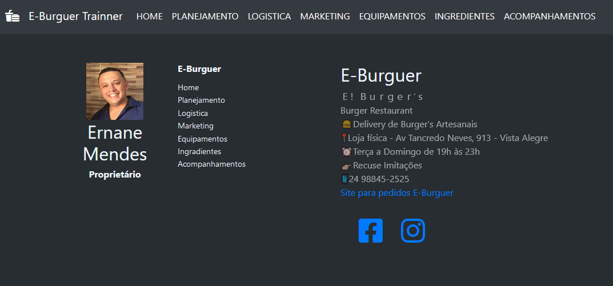
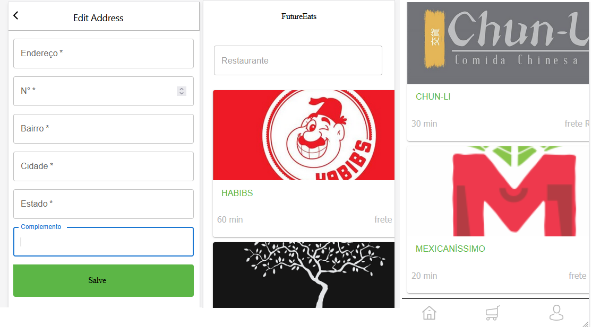

### Hi there 👋 Fabricio Silva I'm 37 years old, Today I'm looking for an opportunity in technology.

</img>

  <a class="gif" href="https://github.com/FabricioMSilva">
  
  

 
  
  
  
  
  
  
  
  
 
  

 
  
  
  
   

  

  <h2> Aprendizado na Labenu </h2>
  
  </img>
  
  
  <h3 align="center"> Módulo 1 - Git, Lógica de Programação e JavaScript</h3>
<li>Conhecendo o Computador e o Terminal, Git, Variáveis, Operadores e Lógica de Programação, Strings e Arrays, Funções, Objetos, Condicionais, Laços, Callback e Funções de Array</li>
<h3 align="center">Módulo 2 - HTML e CSS</h3>
<li>HTML: Elementos e Atributos, CSS, Flexbox e Grid, Responsividade, Concepção de produto e Processos ágeis, Acessibilidade</li>
<h3 align="center">Módulo 3 - Introdução ao React</h3>
<li>Componentes Funcionais, props e styled-components, Componentes de Classe + Estados, Renderização de Listas, Renderização Condicional, Ciclo de Vida em componentes de classe, Debugando React, HTTPS e Postman, Integrações de API, async & await.</li>
<h3 align="center">Módulo 4 - React Avançado e Hooks</h3>
<li>Introdução aos Hooks e useState(),Hook useEffect(), Design Systems, Custom Hooks, Navegação com React Router, Autenticação em aplicações React,  React Context, Estado Global usando Context.</li>
<h3 align="center">Módulo 5 - Introdução ao Backend</h3>
<li>Node e package.json, Typescript, Introdução a APIS e Express.js, Aprofundamento em Express.js</li>

  <h2 align="center"> Matérias Absorvidas na graduação em Sistema de Informação</h2>
 

  

    <li>FUNDAMENTOS DE REDES DE COMPUTADORES</li>
    <li>INTRODUÇÃO A PROGRAMAÇÃO ESTRUTURADA EM C</li>
    <li>INTRODUÇÃO A SEGURANÇA DA INFORMAÇÃO</li>
    <li>ORGANIZAÇÃO E ARQUITETURA DE COMPUTADORES</li>
    <li>PLANEJAMENTO DE CARREIRA E SUCESSO PROFISSIONAL</li>
    <li>BANCO DE DADOS</li>
    <li>COMPUTAÇÃO EM NUVEM E WEB SERVICES EM LINUX</li>
    <li>DESENVOLV. WEB EM HTML5, CSS, JAVASCRIPT E PHP</li>
    <li>PARADIGMAS DE LING. DE PROGRAMAÇÃO EM PYTHON</li>
    <li>PENSAMENTO COMPUTACIONAL</li>
  

  

    <li>ANÁLISE DE DADOS</li>
    <li>COMPORTAMENTO ORGANIZACIONAL</li>
    <li>ESTRUTURA DE DADOS EM C</li>
    <li>NEGÓCIOS ELETRÔNICOS</li>
    <li>SISTEMAS OPERACIONAIS COM PRÁTICA EM LINUX</li>
    <li>ENGENHARIA DE SOFTWARE</li>
    <li>GESTÃO DE SERVIÇOS EM TI</li>
    <li>MATEMÁTICA E LÓGICA</li>
    <li>MÉTODOS MATEMÁTICOS PARA APOIO A DECISÃO</li>
    <li>MODELAGEM DE SISTEMAS COM UML</li>

  

  

<h2>Projetos
<h3> 1ª Projeto Particular - Curso de Hamburguer </h3>

<a href="https://e-burguer-trainner.netlify.app/"> </img></a>
<h3> 2ª Projeto LABENU - LabeFood </h3>
<h4> Trabalho feito em grupo na LABENU;
<a href="https://stiff-side.surge.sh/"> </img></a>
<h3> 3ª Projeto PHP -  </h3>
<h4> Trabalho feito em conjunto ao professor da UDEMY;
<a href="https://github.com/FabricioMSilva/projeto-blog.git"> </img></a>
<!--
**FabricioMSilva/FabricioMSilva** is a ✨ _special_ ✨ repository because its `README.md` (this file) appears on your GitHub profile.

Here are some ideas to get you started:

- 🔭 I’m currently working on ...
- 🌱 I’m currently learning ...
- 👯 I’m looking to collaborate on ...
- 🤔 I’m looking for help with ...
- 💬 Ask me about ...
- 📫 How to reach me: ...
- 😄 Pronouns: ...
- ⚡ Fun fact: ...
-->
